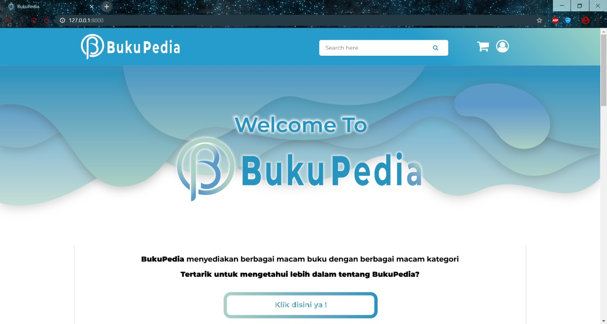
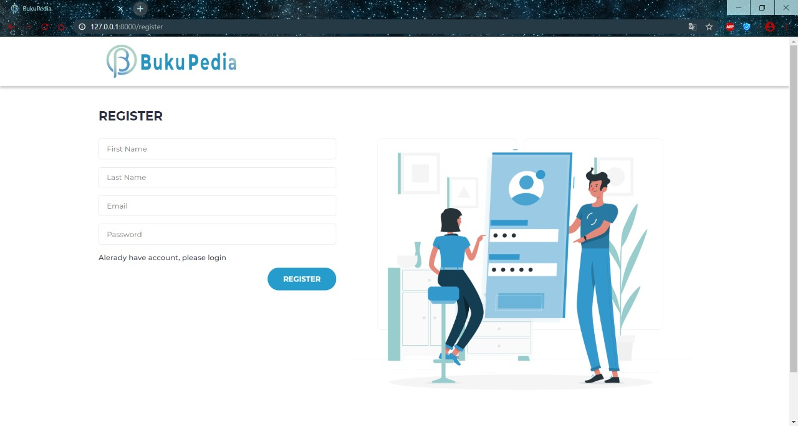

<h2>Laravel 7 E-Commerce Project</h2>

Please kindly check our <a href="https://youtu.be/qThiCCXAjLg">youtube demo</a>

  
  

Dev Team :

<ul>
    <li><a href="https://github.com/Kuasa5Indra">Aditya Indra Pramana</a></li>
    <li>M. Gilang</li>
    <li>Goldy Najma</li>
    <li><a href="https://github.com/sabsabila">Sabila Jamal</a></li>
    <li><a href="https://github.com/shabrinaiu">Ulima Inas Shabrina</a></li>
</ul>
<h2>How to use :</h2>
<ul>
    <li>Clone the repository with git clone</li>
    <li>Copy .env.example file to .env and edit database credentials there</li>
    <li>Run composer install</li>
    <li>Run php artisan key:generate</li>
    <li>Run php artisan migrate --seed (it has some seeded data for your testing)</li>
    <li>Run php artisan serve</li>
    <li>You can login to adminpanel with admin@bukupedia.com password admin</li>
</ul>
<h2>License</h2>
    
Feel free to use and re-use any way you want.

